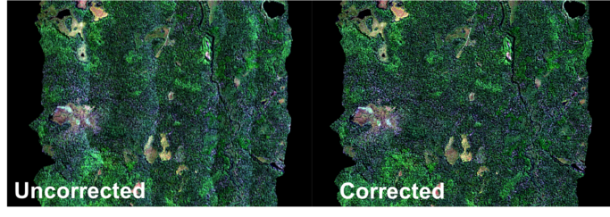
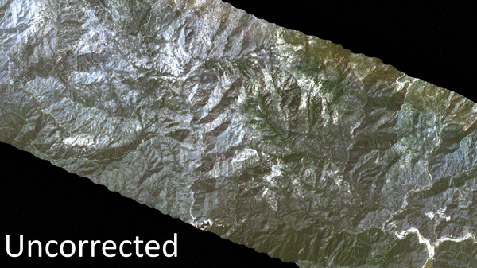

# HyTools

HyTools is a python library for working with imaging spectroscopy data, with a focus on terrestrial scenes. 
At it's core it consists of a series of functions for reading and writing ENVI-formatted images in addition to 
opening NEON-formatted AOP HDF files. Built on top of these functions are a series of higher
level processing tools for data analysis which include spectral resampling, topographic
correction and BRDF correction. Other features are currently under development and include mask generation and
MNF transformation.

We have also created a series of command line tools which string together the processing functions and
provide a more streamlined workflow for processing images.

# Dependencies
- numpy
- h5py
- gdal

# Basic usage
```python
import hytools as ht

hyObj = ht.openENVI('envi_file.bin')
#Loads image to a numpy memmap
hyObj.load_data()

#Calculate NDVI, retrieves closest wavelength to input lambda in nm
ir = hyObj.get_wave(900)
red = hyObj.get_wave(660)
ndvi = (ir-red)/(ir+red)

#Other options for retrieving data
band = hyObj.get_band(10)
column = hyObj.get_column(1)
line = hyObj.get_line(234)
chunk = hyObj.get_chunk(x1,x2,y1,y2)

# Create a writer object to write to new file
writer = ht.file_io.writeENVI('output_envi.bin',hyObj.header_dict)

#Creater iterator object to cycle though image
iterator = raw.iterate(by = 'line')

# Cycle line by line, read from original data
while not iterator.complete:  
   #Read next line
   line = iterator.read_next() 

   #Do some calculations.......
   radiance = line * gain + offset

   #Write line to file
   writer.write_line(radiance,iterator.current_line)
	
   if iterator.complete:
      writer.close()  
```

# Examples

## BRDF Correction
The BRDF correction module consists of a series of tools for removing brightness gradients caused
by variation in solar and viewing geometry. The module uses the combination of the Ross and Li
kernels to model the volumetric, geometric and isometric scattering surfaces and applies a multiplicative
correction to remove brightness gradients. 

 

## Topographic Correction
The topographic correction module uses the Sun-Canopy-Sensor (SCS+C) method developed by [Soenen *et al.* 2005](https://ieeexplore.ieee.org/document/1499030) to remove shadows caused by variation in topography.

 
